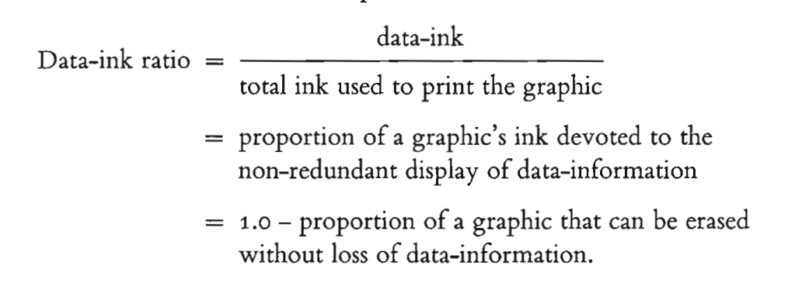
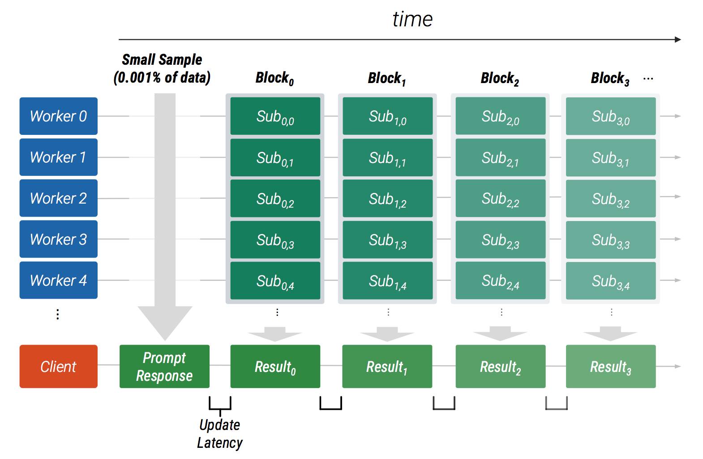
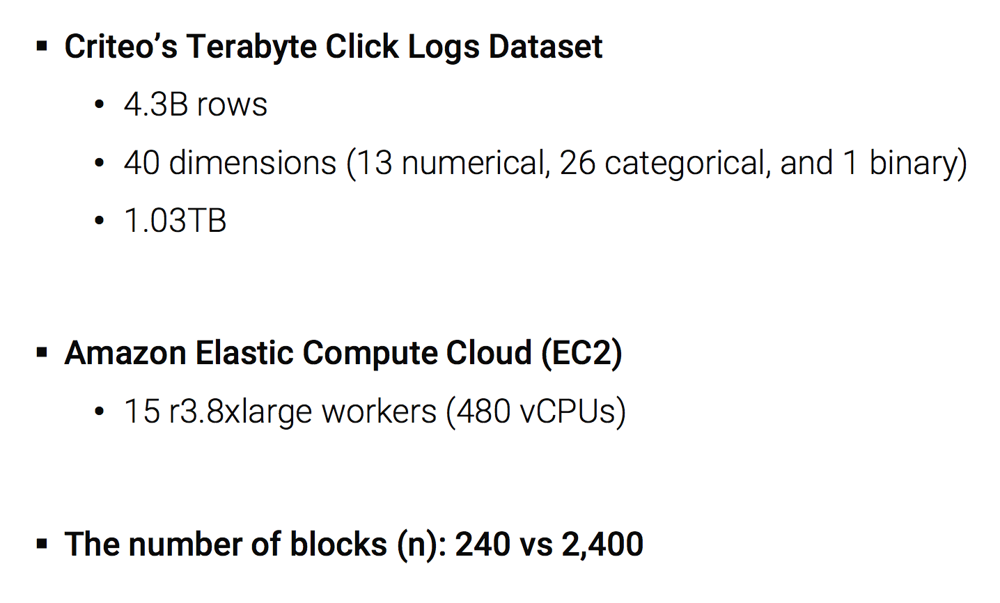

## DATA VISUALIZATION
## 数据可视化

大数据组 |
前端开发工程师 方菲

---

### Overview
- WHY  可视化的简史及作用 
- WHAT 什么是（<b>好的</b>）可视化？ 
- HOW  怎么做可视化？ 
- 大数据 x 可视化 
- BONUS！ 

---
## WHY
### 可视化的简史及作用

+++
#### CASE 1: The Cholera Epidemic in London, 1854
*Original map by Dr. John Snow's*

+++
*A simplified version by E.W.Gilbert*
（1）用‘x’标识抽水井的位置（2）异常值分布更明显

+++
#### CASE 2: The Causes of Mortality in 1858
*The graphic that saved lives by Florence Nightingale (1820-1910)*

+++?image=http://www.florence-nightingale-avenging-angel.co.uk/blog/wp-content/uploads/2012/01/Column4.jpg&size=auto 95%

+++ 
### 可视化发展历程
- 17世纪前： 图表萌芽 - 地图 
- 1600-1699年：物理测量 - 第一幅天气图，small multiple 
- <b>1700-1799年：图形符号</b> - 等高线图、折线图、柱状图 
- <b>1800-1900年：数据图形</b> - 开始较多应用于社会、地理、医学和经济领域 
- 1900-1949年：现代启蒙 - 缺乏创新，但开始面向政府、商业和科学走向应用普及 
- <b>1950-1974年：多维信息的可视编码</b> - 图形符号和表示理论的提出，如”视觉通道“和多维数据编码 
- 1975-1987年：多维统计图形 - Edward Tufte 等人的理论逐渐推动信息可视化发展为一门学科 
- <b>1987-2004年：交互可视化</b> - TableLens 等交互手段、树图的发明；可视化学术会议的出现 
- 2004年至今：可视分析学 - 应对海量、高维、多源和动态数据的分析挑战，辅助用户从中快速挖掘有用的信息，以便做出有效决策的新兴学科。

*引用自：《数据可视化》，陈为*

+++ 
### 可视化的主要作用
 
####  Explore 分析数据 
人脑对图形、图像的解析是并行的，而对文字、词语的读取则是串行的。

 
####  Explain 传达数据 
一图胜千言

---
## WHAT
### 什么是（**好的**）可视化？

+++
### 好的可视化需要遵循哪些标准？
- 有效性 |
- 准确性 |

+++?image=assets/img/Graph-distortion.png&size=auto 95%

+++?image=assets/img/Graph-distortion2.png&size=auto 95%

+++
### 好的可视化需要遵循哪些标准？
- 有效性
- 准确性 
- 高效性 

+++?image=assets/img/DataInk-bad.png&size=auto 95%

+++?image=assets/img/DataInk-good.png&size=auto 95%

+++
### 好的可视化需要遵循哪些标准？
- 有效性
- 准确性 
- 高效性 
- 层次性 
- 目的性 |

---
## HOW
### 怎么做可视化？

+++
### 如何选择合适的可视化图表类型？

+++?image=http://www.infographicsblog.com/wp-content/uploads/2011/11/chart-suggestion-infographic.jpg&size=auto 100%

+++
### 如何选择可视化工具？

+++?image=https://media.opennews.org/img/24tools/big_chart.png&size=auto 95%

--- 
### 大数据 x 可视化
- 学术案例：SwiftTuna - Responsive and Incremental Visual Exploration of Large-scale Multidimensional Data
- 商业案例：阿里云 DataV 数据可视化

+++
## SwiftTuna
Responsive and Incremental Visual Exploration of  <b>Large-scale Multidimensional Data</b>

  

*Jaemin Jo, Wonjae Kim, Seunghoon Yoo, Bohyoung Kim, and Jinwook Seo, Human-Computer Interaction Laboratory, Seoul National University and Hankuk University of Foreign Studies*

+++?image=http://hcil.snu.ac.kr/system/researches/representative_images/37/retina/f811ad74c93c19adf1e9919be042726978c001bf.png&size=auto 90%

+++
#### 亮点1：增量式计算与快速响应的可视化

+++?image=assets/img/SwiftTuna-vis1-1.png&size=auto 90%

+++?image=assets/img/SwiftTuna-vis1-2.png&size=auto 85%

+++
#### 亮点2：Scalable Visualization

+++?image=assets/img/SwiftTuna-vis2-1.png&size=auto 90%

+++?image=assets/img/SwiftTuna-vis2-2.png&size=auto 80%

+++
#### Benchmark Result 测试结果

+++?image=assets/img/SwiftTuna-result.png&size=auto 90%

+++
### 阿里云 DataV 数据可视化

阿里云出品的拖拽式可视化工具，专精于业务数据与地理信息融合的大数据可视化。

+++?image=http://img2.tbcdn.cn/L1/461/1/c84ee736100d1c934dce12d324ba4b59e2542d61.png&size=auto 80%

+++
#### 亮点1：实时架构（以飞线的处理流程为例）

+++
#### 亮点2：创新的设计与开发模式
从(设计-> 开发) 到 (设计-> 开发 -> 设计-> 开发)

---
### BONUS！

+++
#### Storytelling：[新“口红效应”](https://feifang.github.io/New-Lipstick-Effect/)

+++
### Resource
- eagereyes — Visualization and Visual Communication: https://eagereyes.org/
- FlowingData: flowingdata.com
- Visualizing Data: www.visualisingdata.com
- information aesthetics - Data Visualization & Information Design: http://infosthetics.com/
- Information is Beautiful: www.informationisbeautiful.net/

---
## THANK YOU!
